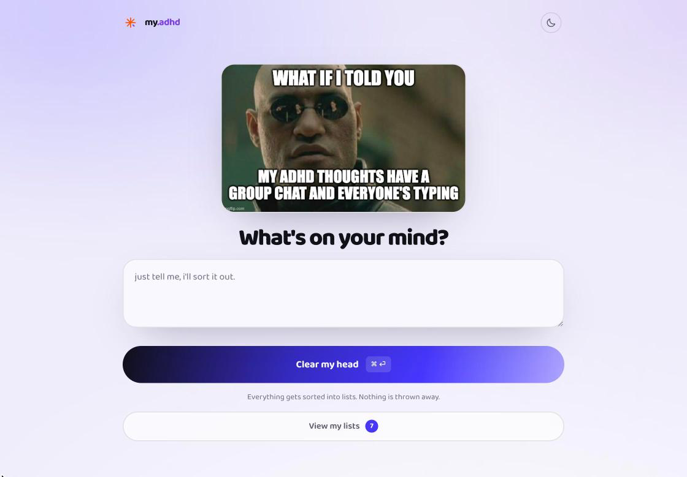
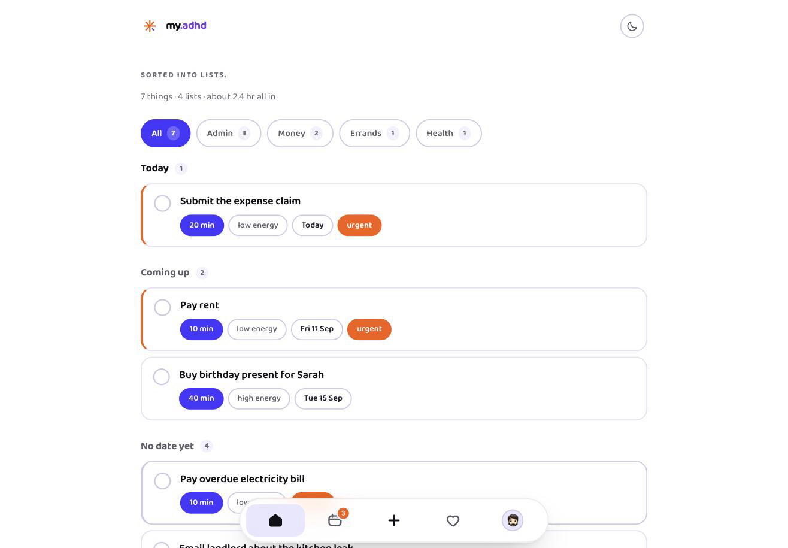
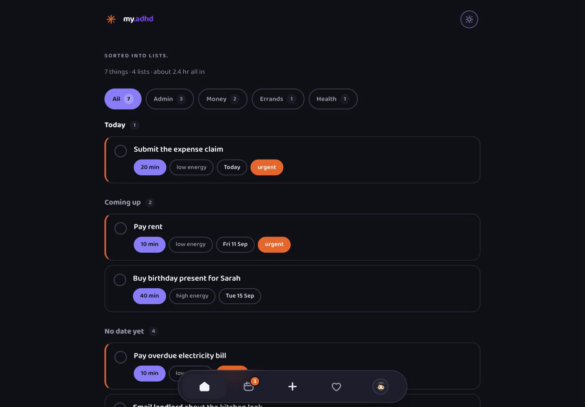

# my.adhd — MVP #1

<picture>
  <source media="(prefers-color-scheme: dark)" srcset="docs/morph-dark.gif" />
  
</picture>

**Brain dump → auto-triage → one task.**

Live at **[myadhd.my](https://myadhd.my)** — the app itself is
at [/app](https://myadhd.my/app).

The whole app does one thing: you empty your head into a box, and it hands back
a single task with a 2-minute first step. Everything else is parked out of sight.

## The feature

1. **Dump** — one textarea, no structure, no categories.
2. **Triage** — Claude turns the mess into structured tasks: rewritten title,
   realistic minutes, energy cost, urgency, and a first step small enough that
   refusing feels stupid.
3. **The lists** — everything comes back grouped by category (work, admin,
   money, health, home, social, errand). Within a list: most urgent first,
   then shortest. Between lists: whichever holds the most urgent item leads.
   Tap a task for its first step, "break it down", and **Edit / Remove**.
   Completed items collect in a "N done" row with undo.

### Dumps accumulate

A dump **adds** to the lists — it never replaces them. Identical open titles
are skipped so repeating yourself doesn't create duplicates. Opening the app
always lands on the dump box; the lists are one tap away via **View my lists**,
which shows the open count.

### Why it orders what it orders

`groupByCategory()` in `app.js` sorts **within** a list by urgency, then by
length — short tasks win ties, because momentum beats optimality. **Between**
lists, whichever holds the most urgent item leads.

**Energy is captured but does not affect ordering.** The model rates every
task `low` / `medium` / `high` and the chip on the row shows it, but nothing
sorts on it.

That is a gap, not a design decision, and it has a second half. The *fuel*
selector (running on fumes / okay-ish / wired) that fed it **no longer exists
in `app.html`** — the markup and CSS are gone, while the wiring for
`.energy-opt` is still in `app.js` (twice) and matches nothing. So
`state.energy` is pinned at `'medium'` for everyone and is sent to
`/api/triage` on every triage and breakdown call as a constant.

The dead wiring is left in deliberately: it is the hook a "just one thing"
focus screen would pick up, which is where the missing `score()` — urgency,
then a penalty on tasks needing more fuel than the user has — belongs. Delete
it only if that idea is dropped for good.

## Screens

Real output — the lists below are what the model returned for one dump of seven
things, not mock-ups.

| Dump | Lists |
|---|---|
|  |  |

Same screen on the dark theme, via the header toggle:



Note the single orange **urgent** pill on the rent task. Vivid Orange is
reserved for *act now* — one thing at a time, or it stops meaning anything.

## Running it

**No build step**, but the pages link to `/app` and `/install` rather than the
`.html` behind them, so `file://` no longer resolves. `npm run dev` (or
`python3 serve.py`) applies the same cleanUrls rule Vercel does. Without the
serverless function it still works — sorting falls to the local heuristic
parser (`parseLocally`). You lose AI-quality triage and the "break it down"
button, and nothing else.

For the real thing you need the serverless function, which needs Vercel:

```bash
npx vercel dev
```

### Requirements

**To run or deploy the app: nothing beyond Node and Vercel.** `npm install`
pulls the one dependency (`@anthropic-ai/sdk`), and every generated asset is
committed, so a fresh clone runs as-is.

**To regenerate the logo animation** you also need Python 3.9+ and:

| | for | without it |
|---|---|---|
| **Pillow** | rasterising frames, writing the gif | `render.py` won't run |
| **ffmpeg** | encoding the mp4s | gif still written, mp4 skipped with a notice |

```bash
python3 -m pip install --user Pillow imageio-ffmpeg
```

`imageio-ffmpeg` ships a self-contained ffmpeg binary and needs no Homebrew or
`sudo`; `render.py` prefers an ffmpeg already on `PATH` and falls back to it.
Neither is in `package.json` — they are build tooling for `animation/source/`,
not runtime dependencies, and nothing in the deployed app touches them.

## Deploying

**One Vercel project — `myadhd`, serving <https://myadhd.my>** — linked
to this repo, so a push to `main` deploys. There were briefly four projects on
the same repo, each rebuilding on every push; the other three are deleted. If
you find yourself with a spare, delete it rather than leaving it to serve a
stale copy on a near-identical URL.

Manual deploys, if you need one:

```bash
npx vercel --prod
```

`ANTHROPIC_API_KEY` lives in that project's Environment Variables. It is only
ever read server-side in `api/triage.js` — it never reaches the browser.

**Env vars are per-project and do not survive being moved to a new one, and
their absence is silent**: `api/triage.js` returns 500, the client swallows it,
and the app falls back to the local heuristic parser. You get worse titles and
guessed times with no error — only the small "sorted offline" banner says so.
After any project change, dump something real and check that banner is absent
before trusting the deployment.

`@anthropic-ai/sdk` is pinned to an exact version (`0.120.0`), not a range —
`api/triage.js` depends on beta request parameters (`betas`, `fallbacks`,
`output_config`), so a floating dependency can change behaviour under you with
no code change. Bump it deliberately and re-test both modes of `/api/triage`.

There is no lockfile, so transitive dependencies still resolve fresh on each
build. Run `npm install` locally and commit `package-lock.json` if you want
fully reproducible builds.

## Data

`localStorage`, key `myadhd.v1`, and that is the source of truth whether or
not there is an account. Nothing about opening the app touches the network:
signup friction is where ADHD users leave, so signing in stays optional for
ever.

Signed in, `cloud.js` keeps a second copy of the tasks in the `tasks` table so
the same lists turn up on every device. It is a reconcile, not a replacement —
`load()` and `save()` still read and write `localStorage`, and a pass merges
the two sides afterwards.

Conflicts are settled last-write-wins per task on `updatedAt`, which `save()`
stamps only on the tasks whose contents actually changed. Per task rather than
per store on purpose: whole-store versioning would make two devices that each
added something between passes lose a whole list, where this loses at most one
edit to one task edited in two places at once. Deletes travel as tombstones —
the row stays and `deleted` goes true — because an absent row cannot say
anything. `cloud.js` opens with the long version.

Its own bookkeeping lives under `myadhd.cloud.v1`: a signature per task, which
is what makes a `save()` that changed nothing send nothing, and the ids this
device has deleted.

The profile name and face, the energy setting and the calendar link do not
sync. They are per device deliberately.

A pass runs on a write, on `visibilitychange` / `pageshow` / `focus` /
`online`, and on a timer that ticks every 15s but only acts once `POLL` has
actually elapsed — browsers throttle timers in background tabs, so an
interval of exactly `POLL` drifts and leaves a device minutes past due. The
account card's **Sync now** forces one, because a device that has not checked
in looks exactly like a device that is already up to date.

The Google Calendar link keeps its own small record under `myadhd.gcal.v1`:
whether it is linked, which calendar it made, and the access token until it
expires. The token was memory-only until iOS proved that unworkable — see
[Where the auth lives](#where-the-auth-lives) for why it changed and what
makes the trade acceptable.

## Google Calendar

Off by default, and invisible until it is configured. When it is on, every task
that carries a day is mirrored into Google Calendar; tick it off, delete it, or
clear the lists and the event goes with it. It is one-way — the app is the
source of truth and the calendar is a view of it, so an event edited on the
Google side is put back the next time its task changes.

### What it is allowed to do

The scope is `calendar.app.created`. That lets the app create **its own**
secondary calendar, named `my.adhd`, and edit events on that one only. It
cannot read, change or delete anything on the calendars you already had — not
because it politely declines to, but because Google will not let it. The
calendar shows up in the normal Google grid with its own colour and its own
checkbox, so it can be hidden without unlinking anything.

### Where the auth lives

In the browser, and nowhere else. Google Identity Services hands out an access
token that lasts an hour; there is no client secret, no refresh token, and no
server-side session, because there is no server-side anything. The API calls in
`gcal.js` go straight from the browser to `googleapis.com` and never touch
`/api`. Unlinking revokes the token and forgets the link; the events already in
Google are left where they are.

**The token is kept in `localStorage` until it expires, and that reversed an
earlier decision.** It was memory-only, on the reasoning that a bearer
credential on disk is readable by anything that can run script on the origin —
and the only cost looked like one silent round-trip after a reload.

iOS disproved that. Silent renewal needs Google's iframe on
`accounts.google.com` to read its own session cookie, and Safari's tracking
prevention refuses third-party cookie access; a home-screen install is worse
still, because it gets a storage container with no Google session in it at all.
So every reopen failed to renew, and the app demanded a reconnect before it
would save one dated task. A security property nobody can use is not a security
property.

What makes the trade acceptable is the scope. `calendar.app.created` means the
worst this token can do is edit the app's own calendar — it cannot read, change
or delete anything on the calendars the user already had. There is no XSS path
to it either: every piece of task text reaches the DOM through `textContent`,
and all eight `innerHTML` writes in `app.js` are either clearing a node or
writing a static SVG. A token that could reach a real diary would not be worth
persisting. This one is.

### Setting it up

The console calls this area **Google Auth Platform** now (it used to be "OAuth
consent screen"), at **APIs & Services → Google Auth Platform**.

1. In the [Google Cloud Console](https://console.cloud.google.com/), make a
   project (or pick one) and enable the **Google Calendar API** under
   **APIs & Services → Library**.

2. **Google Auth Platform → Branding.** App name, user support email, developer
   contact email. This is what the consent screen shows, so the app name is the
   one the user reads when deciding whether to trust it.

3. **Google Auth Platform → Audience.** Choose **External**.

   Then **publish the app** rather than leaving it in Testing. Testing mode
   expires every authorisation **seven days after consent** — the app degrades
   politely to its "Needs reconnecting" card, but it means pressing Reconnect
   roughly weekly for ever. Published-and-unverified is the better resting
   place for personal use: it does not expire, and the cost is a one-time
   "Google hasn't verified this app" interstitial (*Advanced → Continue*).

4. **Google Auth Platform → Data Access.** Add the scope
   `https://www.googleapis.com/auth/calendar.app.created`.

   Check whether the console tags it **Sensitive**. If it does not, an
   unverified published app is all this ever needs. If it does, the app still
   works unverified for personal use behind the interstitial, capped at 100
   users; verification is only worth doing if this is ever handed to strangers.

5. **Google Auth Platform → Clients.** Create an **OAuth client ID**, type
   **Web application**. Add every origin the app is served from to **Authorised
   JavaScript origins**:

   ```
   https://myadhd.my
   https://www.myadhd.my
   http://localhost:8000
   ```

   Include the `www` form only if the site actually answers on it. Every
   origin listed has to be one you serve, and one you have verified ownership
   of if the app ever goes for verification -- which is why the custom domain
   matters more than it looks. `myadhd.vercel.app` can stay on the list while
   the domain is settling, but it is not a domain you own, so verification
   will not accept it.

   Origins only — no path, no trailing slash. Leave **Authorised redirect URIs**
   empty; the token flow does not use one.

6. Paste the client ID into `config.js`:

   ```js
   window.MYADHD_GOOGLE_CLIENT_ID = '1234567890-abc.apps.googleusercontent.com';
   ```

7. Deploy. The card appears on the profile screen.

The client ID is public — it is in every OAuth request Google performs and in
Google's own sample code. What actually stops anyone else using it is the
authorised-origins list in step 5, which is why that step is the one to get
right. Leave `config.js` empty and the feature does not appear at all; the rest
of the app is unchanged.

Vercel previews get a new origin per deployment, so the card will fail to link
on a preview URL unless that exact origin has been added. Test on production or
on localhost instead; this is expected rather than broken.

### Letting other people link, not just you

Everything above gets *you* linked. Opening it to other people needs two more
things, in this order:

1. **Publish the app** (Audience -> Publish). Unpublished means the 7-day
   expiry and a 100-user cap.
2. **Check whether the console tags `calendar.app.created` as Sensitive.** If
   it does not, there is nothing else to do -- no verification, no warning
   screen, no cap. If it does, verification is needed to lose the
   "Google hasn't verified this app" interstitial, and that wants a homepage,
   a privacy policy, terms, a demo video, and a domain you can prove you own.

The site carries `/privacy` and `/terms` for exactly that, both linked from the
landing page where a reviewer will look for them.

### When it will not link

| What you see | What it is |
|---|---|
| `origin_mismatch`, or the popup closes instantly | The origin is not in the authorised list, or has a trailing slash or a path on it |
| "Google hasn't verified this app" | Published but unverified. *Advanced → Continue*. Expected for personal use |
| The card goes amber about weekly | The app is still in **Testing**; grants expire after 7 days. Publish it (step 3) |
| `idpiframe_initialization_failed`, or silent renewal never succeeds | Third-party cookies are blocked for `accounts.google.com`. The Reconnect button still works |

### How the sync works

A reconcile, not a queue. Each task keeps `gcal: { id, sig }` — the id of its
event and a signature of the fields the event is built from. A pass walks the
tasks and fixes the difference:

| Task | Event |
|---|---|
| Has a day, no `gcal` | created |
| Has a day, `sig` moved | patched |
| Ticked off, or its day was taken away | deleted, `gcal` cleared |
| Deleted from the store | id parked in `state.gcalOrphans`, deleted next pass |

Nothing is lost by running it twice, which is what makes it survive the things
that actually go wrong: a closed laptop mid-sync, a dead tunnel, a token that
aged out between two calls. It is debounced 1200ms behind `save()` so a triage
that lands eight tasks is one burst rather than eight, capped at 24 operations
a pass so a first link with a backlog does not trip the rate limiter, and run
again on tab focus and on `online`.

A task with a time becomes a timed event of `minutes` length; a task with only
a day becomes an all-day event. The first step travels in the description,
because "Open the letter and read the first line" is worth far more in a phone
notification than the task title repeated.

### Still not in it

Reading events back out, so the app never knows you are busy. Recurrence.
Reminder overrides. Multiple calendars. Sharing. All of those want a two-way
sync, and a two-way sync wants conflict resolution, which wants a server.

## Files

| File | What it is |
|---|---|
| `index.html` | Landing page — the front door. Full-bleed hero + copy |
| `landing.css` | Landing-only layout |
| `app.html` | The app. Six screens: dump, loading, lists, calendar, feedback, profile — plus the composer sheet, the tab bar, and the mascot and logo SVG sprite |
| `theme.css` | Palette, type, mascot colours. Loaded by **both** pages before their own stylesheet |
| `mascot.svg` | Standalone mascot for the landing hero (`` can't read the page's CSS, so its colours are baked in) |
| `favicon.svg` | The logo mark, standalone |
| `fonts/` | Baloo 2 (variable, wght 400-800), self-hosted |
| `docs/` | README screenshots and the two theme gifs. Not served by the app |
| `styles.css` | App layout: one white page, content held to `--measure` (720px), gradient pill actions |
| `app.js` | State, triage call, ordering, rendering, the composer, the calendar, the profile, the calendar sync |
| `gcal.js` | Google Calendar: the OAuth token dance and the three verbs. Loads before `app.js`, which only ever asks it whether the feature is available |
| `config.js` | Public front-end config — currently just the Google OAuth client ID. Empty means the calendar feature stays hidden |
| `api/triage.js` | Claude call — triage + breakdown modes |
| `api/feedback.js` | The note sent from the feedback screen. One per device per UTC day |
| `install.html` / `install.css` | The "add to home screen" walkthrough |
| `privacy.html` / `terms.html` | The legal pages. Written against the code -- if they disagree with it, one of the two is a bug |
| `legal.css` | Long-form prose: one measured column. The only stylesheet on the site that is about reading |
| `sw.js` / `site.webmanifest` / `icons/` | The PWA shell: service worker, manifest, and the icon set behind it |
| `animation/` | Logo morph exports — self-animating svg, mp4, gif. For social and this README |
| `animation/app/` | The loading screen's mp4, one per theme. **Loaded by the app** |
| `animation/source/` | `gen.py` (svg), `render.py` (gif + mp4), the four beats, the motion sheet |

## The loading animation

<picture>
  <source media="(prefers-color-scheme: dark)" srcset="docs/morph-dark.gif" />
  
</picture>

The wait on screen 2 is the logo mark morphing through four beats — the full
mark, a burst, a clock, a collapse — and back. It is the **same eight
rectangles** throughout, changing length, thickness and corner radius; nothing
is added, removed or crossfaded, which is what makes it read as one shape
thinking rather than a spinner.

It plays as an **mp4**, from `animation/app/`. H.264 carries no alpha channel,
so the ground is part of the picture — which means one render per theme, each
on that theme's `--surface`, and `paintMorph()` in `app.js` swaps the file
whenever the theme changes. The colours are baked, so unlike the rest of the
app the mark here does not follow a token change; edit `theme.css` and these
two files have to be re-rendered.

Two things that are not obvious and will look like bugs if you undo them:

- **The screen has to start the video itself.** A browser pauses video inside
  a `display:none` screen and does not resume it when the screen is shown, so
  `autoplay` alone leaves the mark frozen on the first frame. `startLoadingCopy()`
  calls `play()` and rewinds, so every wait opens on beat 01.
- **The edge is feathered by a radial mask.** 8-bit yuv420 does not round-trip
  RGB, so the dark ground encodes as `#101018` and decodes as `#11111A`. One or
  two values out of 255 is invisible on its own; the hard edge of the frame is
  what gives it away as a square sitting on the page. Full-range encoding gets
  closer but Chrome still lands a value out, so the fix is to remove the edge
  rather than chase the colour. The mark reaches ~67% of the half-width, so a
  mask solid to 74% clips nothing.

**Retiming happens in `gen.py`, not here.** `DUR` there drives the svg, and
`render.py` re-renders every video from it — the loading screen included.

    sed -i '' 's/DUR="4s"/DUR="6s"/' animation/source/gen.py
    python3 animation/source/gen.py && python3 animation/source/render.py

Don't slow it past the wait itself — a triage that returns in 2s should not
cut the mark off mid-beat. Don't speed it up either; below ~3s the morph reads
as a twitch.

Reduced motion is honoured in `app.js`: the video is left unplayed and held on
its first frame, beat 01, the full mark. The screen loses the motion, not the
logo.

**`animation/` holds the standalone exports, and they will drift.** All three
carry the dark `#21262A` ground and the pre-token brand hexes — deliberately,
because Threads and Reels need an opaque frame, not a themed one, and the gif
embedded above has to carry its own colours too. But it means none of them
follow a palette change the way the inline SVG in `app.html` does. They ship to
Vercel as static files (~360KB) and no page requests them.

**This README embeds the gif, not the svg.** Both animate on GitHub and the
svg is far smaller, but the gif renders the same everywhere the README travels
— mirrors, npm-style viewers, editors and clients that show markdown but
freeze or refuse SMIL. The svg stays the master the gif is rendered from.

It embeds **two** gifs, in a `<picture>` that swaps on `prefers-color-scheme`.
The ground is baked into the frame, so a single file shows as a coloured tile
on whichever theme it was not made for — `docs/morph-light.gif` sits on
`#FFFFFF` and `docs/morph-dark.gif` on `#0D1117`, GitHub's two canvas colours,
so the frame edge disappears either way. Readers download one, not both.
`animation/my-adhd-morph.gif` stays as the social export on the brand ground.

The gif is tuned for that job rather than for archival quality: 360px (a
little under 2x the ~200px it displays at) and a **fixed 16-colour palette** named from the
three brand hexes and the blends between them. Median-cut allocates palette
entries by area, so at low colour counts it starves the small purple capsule
and drifts it toward brown — the one hue in the mark that cannot move. Naming
the ramps keeps all three source colours exact and lands smaller than the
median-cut palette it replaced.

All three run at **4s**, matching the loading screen, so the README shows the
loop at the pace it actually plays in the app.

`animation/source/gen.py` is that generator. It rewrites the standalone morph
SVG and the four static beats from one place:

    python3 animation/source/gen.py

The choreography lives in the state tables at the top as `(inner, outer, width,
radius, opacity)` per arm — `LOGO[3]` is the purple capsule. Edit those, not the
generated SVGs, which are overwritten on every run.

It regenerates `my-adhd-morph.svg` and the four beats. The mp4 and gif come
from `render.py`, so a retime is two commands and nothing is left behind:

    python3 animation/source/gen.py       # svg + the four beats
    python3 animation/source/render.py    # gif + mp4, from that svg

`render.py` reads the SVG and evaluates its SMIL rather than screen-recording
the loop, which is what the video files used to be — that capture step is why
they drifted out of step with the vector every time the timing changed. It is
not a general SVG renderer; it understands exactly the shapes `gen.py` emits.

It needs Pillow, and ffmpeg for the mp4 — see [Requirements](#requirements).

Note it emits the original hexes, because its job is the standalone exports.
The app's copy is the inline SMIL in `app.html`, tokenised separately —
changing `gen.py` does not touch the loading screen. `DUR` is the one value
now deliberately kept in step across both, at 4s.

## Pages

`index.html` is the landing page; every CTA on it points at `app.html`.

It is **one viewport and nothing more** — `100dvh`, sized in `vh`/`dvh`
clamps, with `overflow:hidden` on the body so it never scrolls. Hero, CTA,
and a one-line disclaimer; no sections below. If you add anything, re-check
it at 320x568 and in landscape, because there is no scrollbar to absorb
overflow — content will simply be cut off.

The copy makes no clinical claims. It describes what starting a task feels
like and what the app does about it — nothing about causes, diagnosis, or
treatment. The footer says so outright. Keep it that way.

## Design system

The app is **light by default and has a dark mode** — the Theme section below
covers how the choice is made. `:root` sets `color-scheme:light`, and the dark
values live in two places: a `prefers-color-scheme:dark` block and a
`:root[data-theme="dark"]` block, so both the system preference and the toggle
are served.

`html`, `body` and the `theme-color` meta **follow the active theme** rather
than being pinned white. `html{background:var(--surface)}` keeps the iOS
overscroll band in step with the page, and `paintTheme()` in `app.js` rewrites
`theme-color` on every toggle so the browser chrome doesn't sit on the other
scheme.

The app is a page, not a phone mock: no card, no shadow, no tinted backdrop.
Content is centred and capped at `--measure`. The landing page is the
exception — it is deliberately dark, and hardcodes its own colours rather
than relying on theme tokens.

Palette lives in `theme.css` `:root` as brand tokens (`--blue`, `--navy`, `--stone`,
`--orange`, `--pale`, `--grad`); the semantic tokens (`--ink`, `--accent`,
`--muted`) point at those, so changing a brand hex updates the whole app.
Vivid Orange is reserved for one thing — the "start here" first step. It
means *act now*, and it stops meaning that if it decorates anything else.

Type is Baloo 2, served from `fonts/` — no Google Fonts request, so the app
still renders correctly offline. `Baloo2-ExtraBold.ttf` is unused; the
variable file covers 400-800 on its own.

**`mascot.svg` duplicates the mascot geometry** held in the `index.html`
sprite — an `` cannot reference a symbol defined in another document.
Edit the character in one and copy it to the other, or they will drift.

The mascot and the logo are inline SVG symbols at the top of `index.html`
(`#mx-head`, `#mx-bust`, `#logo-mark`), pulled in with `<use>` and coloured
through tokens — so each shape is defined once for the whole app.

The logo is a seven-arm asterisk: the eighth arm is detached and carried by
the violet capsule off the lower right. That gap is the mark — closing it
into a plain eight-point star loses the whole idea. `favicon.svg` repeats
the geometry standalone, so the two must be edited together.

## Theme

The app **defaults to light**. The system preference does not decide — the
header toggle does, and until someone uses it the app stays white even on a
phone in dark mode. The choice is stored under `myadhd.theme` and a saved
choice always wins.

The default is stamped on `<html>` by an inline script in `<head>`, before
first paint. That placement is load-bearing: `data-theme="light"` is what
beats the `prefers-color-scheme:dark` block in the stylesheet, and doing it
later would show a flash of dark first.

Because that script always stamps *something*, the `prefers-color-scheme:dark`
block is guarded by `:root:not([data-theme="light"])` and in practice only
wins when the script never ran — i.e. with JavaScript disabled. It is the
no-JS fallback, not dead code. Deleting it means a no-JS visitor on a dark
phone gets the light app; deleting the guard instead means a dark phone
overrides a saved light choice.

## Repairing one task

The model splits, merges and rewrites, and it gets things wrong. Without a
per-task exit the only two moves were lying about it with the tick or
**Clear everything** — so **Edit** and **Remove** sit in the task detail,
under "break it down".

They are the quietest controls on the screen on purpose: they are the exits,
not the offer. Both are inside the detail, so the collapsed row stays
scannable.

- **Edit** swaps the title for a field in place — Enter or blur commits,
  Escape cancels, and an empty value is refused. It deliberately does **not**
  re-render the lists: a redraw would collapse the very detail the button was
  pressed in. Nothing else on screen derives from the title, so editing in
  place is safe. The field stops `click`, `pointerdown` and `touchstart` from
  bubbling, because the row toggles its own detail on click and without that
  every tap into the field would shut it.
- **Remove** is not "done". The tick means *I did this* and feeds the done
  count; Remove is for the ones the model invented, and it leaves no trace.
  Undo is the whole safety net, so the task goes back at the index it left
  rather than being appended.

Undo is offered through the toast, which now takes an optional
`{label, fn}` action and lives for 6s rather than 2.6s when it carries one —
a message only has to be read, an offer has to be reached.

## The done pile clears itself

Ticked tasks used to be kept for ever: re-rendered on every visit to the
lists, counted on the profile, and growing the `localStorage` record without
limit.

`pruneDone()` runs once at startup, before anything is drawn, and drops
finished tasks older than **`DONE_TTL`, 7 days** — long enough that undo is
still there the next day. `markDone()` stamps `doneAt`; undo clears it.

**A store written before `doneAt` existed is migrated, not emptied.** Its
finished tasks have no stamp, and a missing timestamp means we don't know
when it happened — guessing "long ago" would silently delete someone's whole
pile the first time they opened the updated app. They are stamped at first
sight instead, so they get a full week from then.

The list also draws only the most recent **`DONE_SHOWN`, 20**, newest first,
with a line counting the rest. The pile exists to be undone from, and nobody
undoes the fortieth thing they ticked last Tuesday.

## Clearing

**Clear everything** sits at the foot of the lists, quiet until armed. It
takes two confirmations, and the armed state times out after 20s so a
half-pressed confirm can't wait around for a stray tap. There is no undo and
no backup — tasks live only in this browser's `localStorage`, and clearing is
final. `--danger` is reserved for this; it is never decoration.

## Deliberately not in v1

Timers, streaks, XP, notifications, sub-projects, tags, accounts. Every one of
those is a reason for the app to feel like homework.

**Calendars were on this list and came off it.** The dump reads days and times
out of plain language, so the dates existed whether or not anything drew
them — the calendar screen shows what was already there rather than asking
anyone to schedule. Nothing else here has earned the same exception yet.

**Google Calendar came off it too, on the same argument and one more.** The
dates were already there; the only question was whether they stayed trapped in
one browser. It stayed honest about the rest of the list by keeping the auth
entirely client-side — there is still no account and still no server holding
anything of yours — and by asking for a scope that cannot touch the calendars
you already had. It is off until you turn it on.
