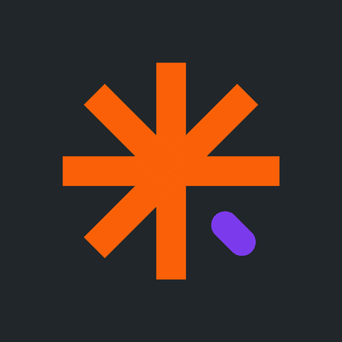

# my.adhd — MVP #1



**Brain dump → auto-triage → one task.**

Live at **[myadhd.vercel.app](https://myadhd.vercel.app)** — the app itself is
at [/app](https://myadhd.vercel.app/app).

The whole app does one thing: you empty your head into a box, and it hands back
a single task with a 2-minute first step. Everything else is parked out of sight.

## The feature

1. **Dump** — one textarea, no structure, no categories. Plus a *fuel* selector
   (running on fumes / okay-ish / wired).
2. **Triage** — Claude turns the mess into structured tasks: rewritten title,
   realistic minutes, energy cost, urgency, and a first step small enough that
   refusing feels stupid.
3. **The lists** — everything comes back grouped by category (work, admin,
   money, health, home, social, errand). Within a list: most urgent first,
   then shortest. Between lists: whichever holds the most urgent item leads.
   Tap a task for its first step and "break it down". Completed items collect
   in a "N done" row with undo.

### Dumps accumulate

A dump **adds** to the lists — it never replaces them. Identical open titles
are skipped so repeating yourself doesn't create duplicates. Opening the app
always lands on the dump box; the lists are one tap away via **View my lists**,
which shows the open count.

### Why it orders what it orders

`score()` in `app.js` weighs urgency, then **penalizes tasks that need more
fuel than the user currently has**. A task you have no energy for is worse than
useless — it's the one you stare at before closing the app. Short tasks win
ties, because momentum beats optimality.

## Running it

**No build step.** Open `index.html` in a browser and it works — offline, using
the local heuristic parser (`parseLocally`). You lose AI-quality triage and the
"break it down" button, and nothing else.

For the real thing you need the serverless function, which needs Vercel:

```bash
npx vercel dev
```

## Deploying

**One Vercel project — `myadhd`, serving <https://myadhd.vercel.app>** — linked
to this repo, so a push to `main` deploys. There were briefly four projects on
the same repo, each rebuilding on every push; the other three are deleted. If
you find yourself with a spare, delete it rather than leaving it to serve a
stale copy on a near-identical URL.

Manual deploys, if you need one:

```bash
npx vercel --prod
```

`ANTHROPIC_API_KEY` lives in that project's Environment Variables. It is only
ever read server-side in `api/triage.js` — it never reaches the browser.

**Env vars are per-project and do not survive being moved to a new one, and
their absence is silent**: `api/triage.js` returns 500, the client swallows it,
and the app falls back to the local heuristic parser. You get worse titles and
guessed times with no error — only the small "sorted offline" banner says so.
After any project change, dump something real and check that banner is absent
before trusting the deployment.

`@anthropic-ai/sdk` is pinned to an exact version (`0.120.0`), not a range —
`api/triage.js` depends on beta request parameters (`betas`, `fallbacks`,
`output_config`), so a floating dependency can change behaviour under you with
no code change. Bump it deliberately and re-test both modes of `/api/triage`.

There is no lockfile, so transitive dependencies still resolve fresh on each
build. Run `npm install` locally and commit `package-lock.json` if you want
fully reproducible builds.

## Data

`localStorage`, key `myadhd.v1`. No accounts, no signup, no sync — signup
friction is where ADHD users leave. `state` in `app.js` is a plain object, so
swapping in Supabase later means replacing `load()` / `save()` only.

## Files

| File | What it is |
|---|---|
| `index.html` | Landing page — the front door. Full-bleed hero + copy |
| `landing.css` | Landing-only layout |
| `app.html` | The app. Three screens: dump, loading, now — plus the mascot and logo SVG sprite |
| `theme.css` | Palette, type, mascot colours. Loaded by **both** pages before their own stylesheet |
| `mascot.svg` | Standalone mascot for the landing hero (`` can't read the page's CSS, so its colours are baked in) |
| `favicon.svg` | The logo mark, standalone |
| `fonts/` | Baloo 2 (variable, wght 400-800), self-hosted |
| `styles.css` | App layout: one white page, content held to `--measure` (720px), gradient pill actions |
| `app.js` | State, triage call, scoring, rendering |
| `api/triage.js` | Claude call — triage + breakdown modes |
| `animation/` | Logo morph exports — self-animating svg, mp4, gif. For social and this README |
| `animation/app/` | The loading screen's mp4, one per theme. **Loaded by the app** |
| `animation/source/` | `gen.py` (svg), `render.py` (gif + mp4), the four beats, the motion sheet |

## The loading animation


The wait on screen 2 is the logo mark morphing through four beats — the full
mark, a burst, a clock, a collapse — and back. It is the **same eight
rectangles** throughout, changing length, thickness and corner radius; nothing
is added, removed or crossfaded, which is what makes it read as one shape
thinking rather than a spinner.

It plays as an **mp4**, from `animation/app/`. H.264 carries no alpha channel,
so the ground is part of the picture — which means one render per theme, each
on that theme's `--surface`, and `paintMorph()` in `app.js` swaps the file
whenever the theme changes. The colours are baked, so unlike the rest of the
app the mark here does not follow a token change; edit `theme.css` and these
two files have to be re-rendered.

Two things that are not obvious and will look like bugs if you undo them:

- **The screen has to start the video itself.** A browser pauses video inside
  a `display:none` screen and does not resume it when the screen is shown, so
  `autoplay` alone leaves the mark frozen on the first frame. `startLoadingCopy()`
  calls `play()` and rewinds, so every wait opens on beat 01.
- **The edge is feathered by a radial mask.** 8-bit yuv420 does not round-trip
  RGB, so the dark ground encodes as `#101018` and decodes as `#11111A`. One or
  two values out of 255 is invisible on its own; the hard edge of the frame is
  what gives it away as a square sitting on the page. Full-range encoding gets
  closer but Chrome still lands a value out, so the fix is to remove the edge
  rather than chase the colour. The mark reaches ~67% of the half-width, so a
  mask solid to 74% clips nothing.

**Retiming happens in `gen.py`, not here.** `DUR` there drives the svg, and
`render.py` re-renders every video from it — the loading screen included.

    sed -i '' 's/DUR="4s"/DUR="6s"/' animation/source/gen.py
    python3 animation/source/gen.py && python3 animation/source/render.py

Don't slow it past the wait itself — a triage that returns in 2s should not
cut the mark off mid-beat. Don't speed it up either; below ~3s the morph reads
as a twitch.

Reduced motion is honoured in `app.js`: the video is left unplayed and held on
its first frame, beat 01, the full mark. The screen loses the motion, not the
logo.

**`animation/` holds the standalone exports, and they will drift.** All three
carry the dark `#21262A` ground and the pre-token brand hexes — deliberately,
because Threads and Reels need an opaque frame, not a themed one, and the gif
embedded above has to carry its own colours too. But it means none of them
follow a palette change the way the inline SVG in `app.html` does. They ship to
Vercel as static files (~360KB) and no page requests them.

**This README embeds the gif, not the svg.** Both animate on GitHub and the
svg is far smaller, but the gif renders the same everywhere the README travels
— mirrors, npm-style viewers, editors and clients that show markdown but
freeze or refuse SMIL. The svg stays the master the gif is rendered from.

The gif is tuned for that job rather than for archival quality: 360px (a
little under 2x the ~200px it displays at) and a **fixed 16-colour palette** named from the
three brand hexes and the blends between them. Median-cut allocates palette
entries by area, so at low colour counts it starves the small purple capsule
and drifts it toward brown — the one hue in the mark that cannot move. Naming
the ramps keeps all three source colours exact and lands smaller than the
median-cut palette it replaced.

All three run at **4s**, matching the loading screen, so the README shows the
loop at the pace it actually plays in the app.

`animation/source/gen.py` is that generator. It rewrites the standalone morph
SVG and the four static beats from one place:

    python3 animation/source/gen.py

The choreography lives in the state tables at the top as `(inner, outer, width,
radius, opacity)` per arm — `LOGO[3]` is the purple capsule. Edit those, not the
generated SVGs, which are overwritten on every run.

It regenerates `my-adhd-morph.svg` and the four beats. The mp4 and gif come
from `render.py`, so a retime is two commands and nothing is left behind:

    python3 animation/source/gen.py       # svg + the four beats
    python3 animation/source/render.py    # gif + mp4, from that svg

`render.py` reads the SVG and evaluates its SMIL rather than screen-recording
the loop, which is what the video files used to be — that capture step is why
they drifted out of step with the vector every time the timing changed. It is
not a general SVG renderer; it understands exactly the shapes `gen.py` emits.

It needs Pillow, and ffmpeg for the mp4 — either on `PATH` or the bundled
binary from `pip install --user imageio-ffmpeg`. With neither, the gif is
still written and the mp4 is skipped with a notice.

Note it emits the original hexes, because its job is the standalone exports.
The app's copy is the inline SMIL in `app.html`, tokenised separately —
changing `gen.py` does not touch the loading screen. `DUR` is the one value
now deliberately kept in step across both, at 4s.

## Pages

`index.html` is the landing page; every CTA on it points at `app.html`.

It is **one viewport and nothing more** — `100dvh`, sized in `vh`/`dvh`
clamps, with `overflow:hidden` on the body so it never scrolls. Hero, CTA,
and a one-line disclaimer; no sections below. If you add anything, re-check
it at 320x568 and in landscape, because there is no scrollbar to absorb
overflow — content will simply be cut off.

The copy makes no clinical claims. It describes what starting a task feels
like and what the app does about it — nothing about causes, diagnosis, or
treatment. The footer says so outright. Keep it that way.

## Design system

The app is **light by default and has a dark mode** — the Theme section below
covers how the choice is made. `:root` sets `color-scheme:light`, and the dark
values live in two places: a `prefers-color-scheme:dark` block and a
`:root[data-theme="dark"]` block, so both the system preference and the toggle
are served.

`html`, `body` and the `theme-color` meta **follow the active theme** rather
than being pinned white. `html{background:var(--surface)}` keeps the iOS
overscroll band in step with the page, and `paintTheme()` in `app.js` rewrites
`theme-color` on every toggle so the browser chrome doesn't sit on the other
scheme.

The app is a page, not a phone mock: no card, no shadow, no tinted backdrop.
Content is centred and capped at `--measure`. The landing page is the
exception — it is deliberately dark, and hardcodes its own colours rather
than relying on theme tokens.

Palette lives in `theme.css` `:root` as brand tokens (`--blue`, `--navy`, `--stone`,
`--orange`, `--pale`, `--grad`); the semantic tokens (`--ink`, `--accent`,
`--muted`) point at those, so changing a brand hex updates the whole app.
Vivid Orange is reserved for one thing — the "start here" first step. It
means *act now*, and it stops meaning that if it decorates anything else.

Type is Baloo 2, served from `fonts/` — no Google Fonts request, so the app
still renders correctly offline. `Baloo2-ExtraBold.ttf` is unused; the
variable file covers 400-800 on its own.

**`mascot.svg` duplicates the mascot geometry** held in the `index.html`
sprite — an `` cannot reference a symbol defined in another document.
Edit the character in one and copy it to the other, or they will drift.

The mascot and the logo are inline SVG symbols at the top of `index.html`
(`#mx-head`, `#mx-bust`, `#logo-mark`), pulled in with `<use>` and coloured
through tokens — so each shape is defined once for the whole app.

The logo is a seven-arm asterisk: the eighth arm is detached and carried by
the violet capsule off the lower right. That gap is the mark — closing it
into a plain eight-point star loses the whole idea. `favicon.svg` repeats
the geometry standalone, so the two must be edited together.

## Theme

The app **defaults to light**. The system preference does not decide — the
header toggle does, and until someone uses it the app stays white even on a
phone in dark mode. The choice is stored under `myadhd.theme` and a saved
choice always wins.

The default is stamped on `<html>` by an inline script in `<head>`, before
first paint. That placement is load-bearing: `data-theme="light"` is what
beats the `prefers-color-scheme:dark` block in the stylesheet, and doing it
later would show a flash of dark first.

Because that script always stamps *something*, the `prefers-color-scheme:dark`
block is guarded by `:root:not([data-theme="light"])` and in practice only
wins when the script never ran — i.e. with JavaScript disabled. It is the
no-JS fallback, not dead code. Deleting it means a no-JS visitor on a dark
phone gets the light app; deleting the guard instead means a dark phone
overrides a saved light choice.

## Clearing

**Clear everything** sits at the foot of the lists, quiet until armed. It
takes two confirmations, and the armed state times out after 20s so a
half-pressed confirm can't wait around for a stray tap. There is no undo and
no backup — tasks live only in this browser's `localStorage`, and clearing is
final. `--danger` is reserved for this; it is never decoration.

## Deliberately not in v1

Timers, streaks, XP, calendars, notifications, sub-projects, tags, accounts.
Every one of those is a reason for the app to feel like homework.
